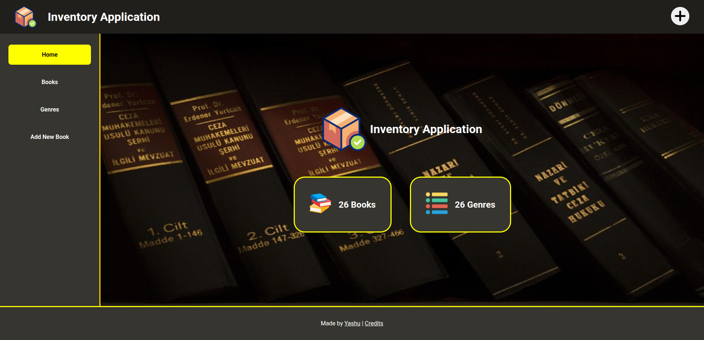
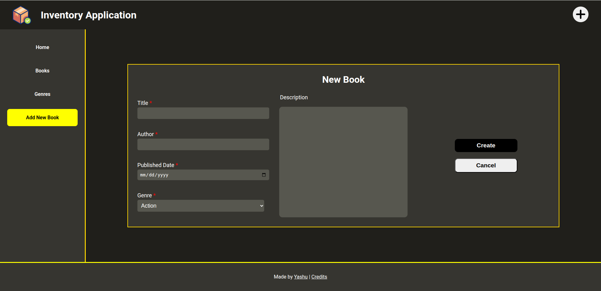
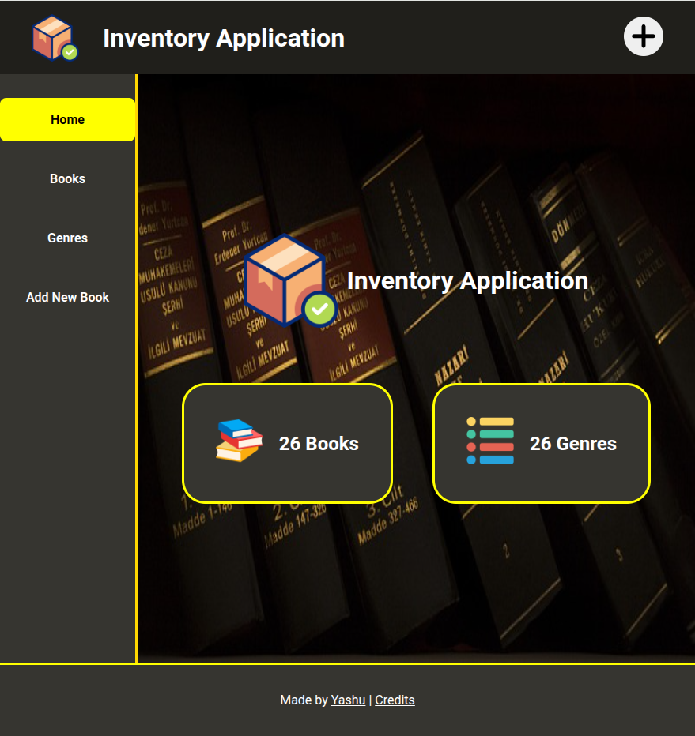

# Inventory Application

<b>An Book Inventory Application that allows users to store book name, author name, genre and some other information about the books. Created specifically to practicing Database management and CRUD actions using Postgres. </b>

### [Live Link]()

# Table of Contents

1. [Introduction](#introduction)
2. [App Showcase](#app-showcase)
3. [Endpoints](#endpoints)
4. [Frontend Stack](#frontend-stack)
5. [Backend Stack](#backend-stack)
6. [Learning Outcomes](#learning-outcomes)
7. [Acknowledgements](#acknowledgements)

## Introduction

An application used to store book and its information. Made using Express and Node.js on backend, EJS as a view template engine and postgres driver for PostgreSQL. This application is part of [THE ODIN PROJECT](https://www.theodinproject.com/dashboard) curriculum in Node.js course.

## App Showcase

| Homepage Desktop                                                  |
| ----------------------------------------------------------------- |
|  |

| New Book Form                                                   |
| --------------------------------------------------------------- |
|  |

| Homepage Tablet                                                  |
| ---------------------------------------------------------------- |
|  |

## Endpoints

| Method | URI                   | Function                                  |
| ------ | --------------------- | ----------------------------------------- |
| GET    | /                     | Getting homepage                          |
| GET    | /books                | Listing all the books                     |
| GET    | /books/add            | Form for adding new book to db            |
| GET    | /books/update/:bookid | Update information of a book              |
| GET    | /genres               | List all the genres and books accordingly |
| POST   | /books/add            | Sends new book data to server             |
| POST   | /books/update/:bookid | Sends updated book data to server         |

## Skill Stack

1. Javascript
2. CSS
3. HTML
4. EJS
5. Node.js
6. Express
7. Express-Validator
8. PostgreSQL
9. Postgres (pg)
10. Git

## Learning outcomes

- Practice and implement Database management and CRUD actions
- Use express-validator to validate user provided data
- Practice Backend handling using express

## Acknowledgements

- Images are used from [Freepik](https://www.freepik.com) , [Pixabay](https://pixabay.com)
- Icons are downloaded from [Flaticon](https://www.flaticon.com)
